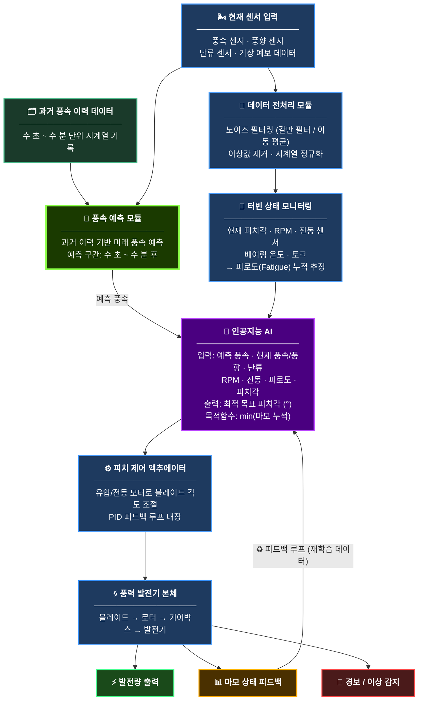

# 풍력발전기 피치각 제어 AI 시스템

바람 조건에 따라 풍력발전기 블레이드의 **피치각(Pitch Angle)을 자동 조절**하여
블레이드 및 기계 부품의 **마모를 최소화**하는 AI 시스템 설계 프로젝트입니다.

> 목표: 단순 발전량 극대화가 아닌, **수명 최대화 + 발전 효율 균형**

---

## 시스템 블록도



---

## 주요 모듈 설명

| 모듈 | 역할 |
|------|------|
| 과거 풍속 이력 데이터 | 시계열 풍속 기록 보관 (예측 모델 입력용) |
| 현재 센서 입력 | 바람 및 터빈 상태 실시간 수집 |
| **풍속 예측 모듈** | 과거 이력 기반으로 미래 풍속 예측 (핵심 추가) |
| 전처리 모듈 | 노이즈 제거, 이상값 처리, 정규화 |
| 상태 모니터링 | 피로도 누적량 추정 (마모 지표) |
| **AI 모듈** | 예측 풍속 + 현재 상태로 최적 피치각 결정 |
| 피치 액추에이터 | 물리적 각도 선제 조절 실행 |
| 피드백 루프 | 결과를 AI에 재입력하여 지속 학습 |

---

## AI 알고리즘 추천

### 1순위: 강화학습 (Reinforcement Learning) - SAC 또는 PPO
- **SAC (Soft Actor-Critic)**: 연속적인 피치각 제어에 가장 적합
  - 마모 최소화 + 발전량 유지를 보상 함수로 설계 가능
  - 불확실한 환경(난류, 돌풍)에 강건함
  - 실제 산업 제어에 가장 많이 채택되는 방식
- **PPO (Proximal Policy Optimization)**: 학습 안정성이 높아 초기 구현에 유리

### 2순위: LSTM 기반 예측 + MPC (Model Predictive Control)
- LSTM으로 수 초~수 분 후 풍속 예측
- MPC로 예측 기반 최적 피치각 계획
- 해석 가능성이 높고 산업 현장 적용이 쉬움

### 3순위: 디지털 트윈 + 신경망
- 터빈 물리 모델(디지털 트윈)과 신경망 결합
- 실제 데이터 없이도 시뮬레이션으로 사전 학습 가능
- 초기 데이터 부족 문제 해결에 유리

### 최종 추천

| 단계 | 추천 AI | 이유 |
|------|---------|------|
| 초기 개발 | PPO 강화학습 | 구현 쉽고 학습 안정적 |
| 고도화 | SAC 강화학습 | 연속 제어에 최적, 마모 최소화에 가장 적합 |
| 산업 배포 | LSTM + MPC 하이브리드 | 해석 가능, 현장 신뢰성 높음 |

---

## 핵심 보상 함수 설계

```
reward = α × 발전량 - β × 피로도 증가량
```

- `α`, `β` 가중치로 발전량 vs 마모 사이 균형 조절 가능
- `β`를 높이면 마모 최소화 우선, `α`를 높이면 발전량 우선

---

## 구현 단계

1. **데이터 수집**: 풍속, 피치각, 진동, 발전량 이력 데이터 확보
2. **보상 함수 설계**: `reward = α·발전량 - β·피로도증가량`
3. **시뮬레이션 환경 구축**: OpenFAST 또는 Bladed 기반 가상 터빈
4. **AI 학습**: 시뮬레이터에서 수천 시간치 학습
5. **실제 배포**: 점진적 A/B 테스트로 안전 검증
6. **지속 학습**: 현장 데이터로 모델 주기적 업데이트

---

## 검증 방법

- 마모 누적량 비교: AI 제어 vs 기존 규칙 기반 제어
- 발전량 손실률 측정 (5% 이내 목표)
- 극단 풍속 시나리오(돌풍, 난류) 시뮬레이션 테스트
- 장기 피로 수명 예측 모델로 수명 연장 효과 수치화
